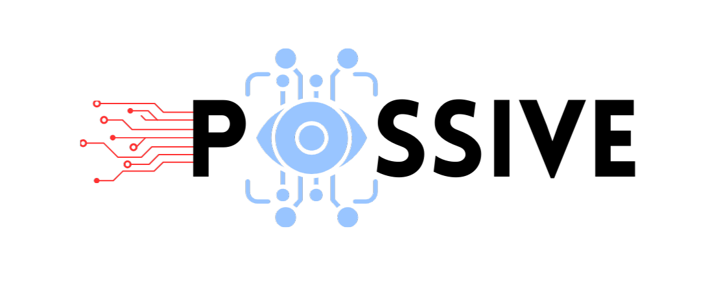
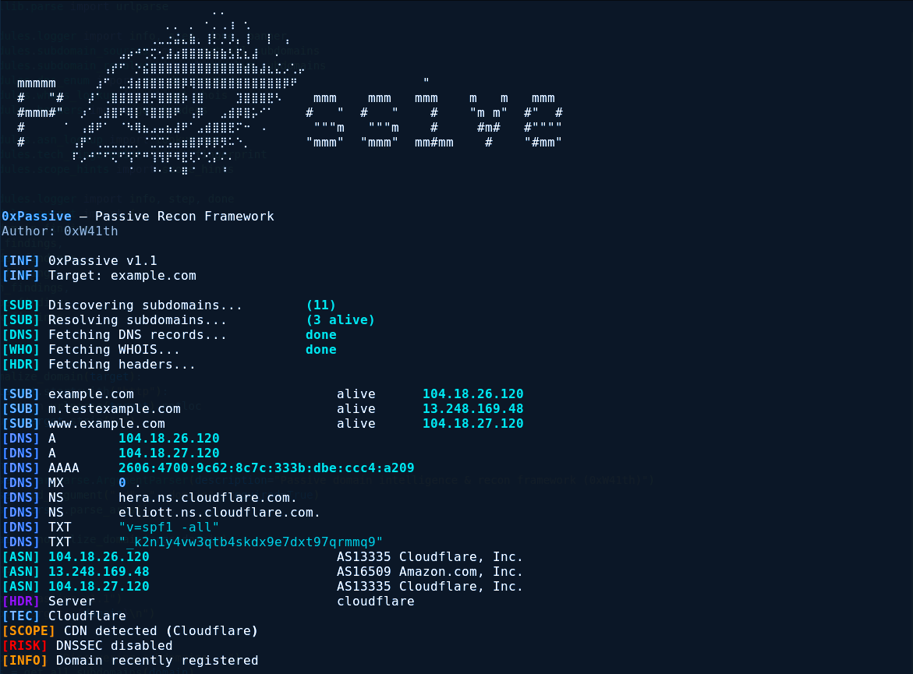

<h1 align="center">
  
  <br>
  OxPassive
</h1>

<h4 align="center">
  A passive domain intelligence & recon framework for security researchers
</h4>

<p align="center">
  
  
  
  
</p>

<p align="center">
  <a href="#features">Features</a> •
  <a href="#installation">Installation</a> •
  <a href="#usage">Usage</a> •
  <a href="#output">Output</a> •
  <a href="#project-structure">Structure</a> •
  <a href="#roadmap">Roadmap</a> •
  <a href="#disclaimer">Disclaimer</a>
</p>

---

## 🚀 What is OxPassive?

**OxPassive** is a **passive reconnaissance framework** built to extract deep domain intelligence **without touching the target**.

No scans.  
No noise.  
No alerts.

Designed for **bug bounty hunters, red teamers, and security researchers** who want clean recon before active testing.

---

## ✨ Features

<p align="center">
  
</p>

- 🔍 Passive subdomain discovery
- 🌐 DNS enumeration (A, AAAA, MX, NS, TXT)
- 🏢 ASN & hosting intelligence
- 🧠 Technology fingerprinting
- 🎯 Scope & CDN detection
- ⚠️ Risk signals (DNSSEC, domain age, misconfigs)
- 📦 Modular & extensible architecture
- ⚡ Single-command execution
- 🛑 Zero interaction with target infrastructure

---

## 📸 Example Output

```bash
python oxpassive.py -d example.com
```

```
[INF] OxPassive v1.1
[INF] Target: example.com

[SUB] Discovering subdomains...
[DNS] Fetching DNS records...
[ASN] Resolving ASN & hosting...
[TEC] Fingerprinting technologies...

✔ api.example.com
✔ dev.example.com
✔ mail.example.com
✔ staging.example.com

[DNS] A     93.184.216.34
[DNS] MX    mail.example.com
[ASN] AS15133 (Cloudflare)
[TEC] nginx, Cloudflare
```

---

## 📦 Installation

```bash
git clone https://github.com/0xW41th/0xPassive.git
cd 0xPassive
pip install -r requirements.txt
```

---

## ⚙️ Usage

```bash
python 0xpassive.py -d example.com
```

---

## 📤 Output

Supports:
- Terminal colored output
- Automation friendly pipelines

Example:
```bash
python oxpassive.py -d example.com
```

---

## 🗂 Project Structure

```
0xPassive/
├── assets/
│   └── logo.png
│   └── screenshot.png
├── modules/
│   ├── asn_lookup.py
│   ├── dns_enum.py
│   ├── headers.py
│   ├── output.py
│   ├── scope_hints.py
│   ├── subdomain_resolver.py
│   ├── subdomain_sources.py
│   ├── tech_fingerprint.py
│   └── whois_lookup.py
├── 0xpassive.py
├── requirements.txt
└── README.md
```

---

## 🛣 Roadmap

- [ ] Add more passive data sources
- [ ] Shodan / Censys integration
- [ ] SQLite output
- [ ] Nuclei auto template generation
- [ ] Config file support
- [ ] Web dashboard
- [ ] GitHub releases

---

## ⚠️ Disclaimer

This tool is for **educational and authorized security testing only**.  
You are responsible for how you use it.

---

## ❤️ Author

Built with ⚡ by **0xW41th**  
If you like it, give a ⭐ and share with the community.
